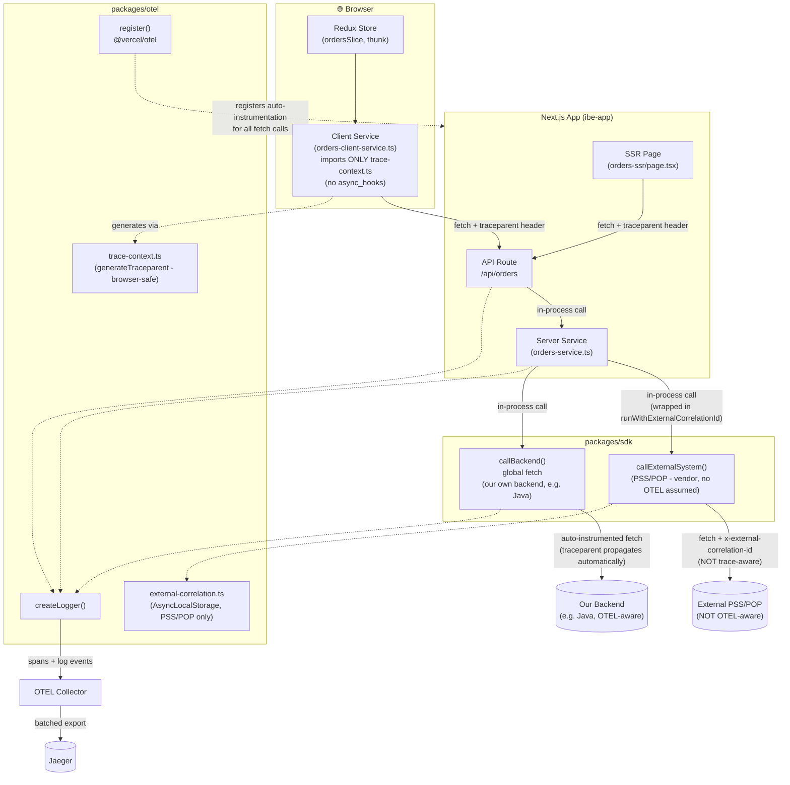
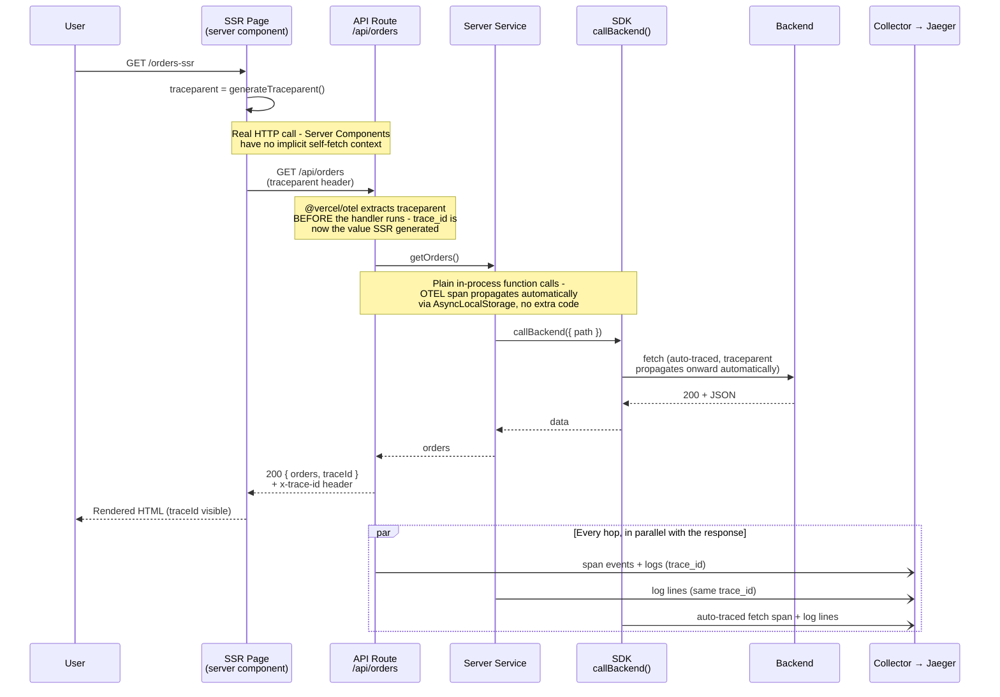
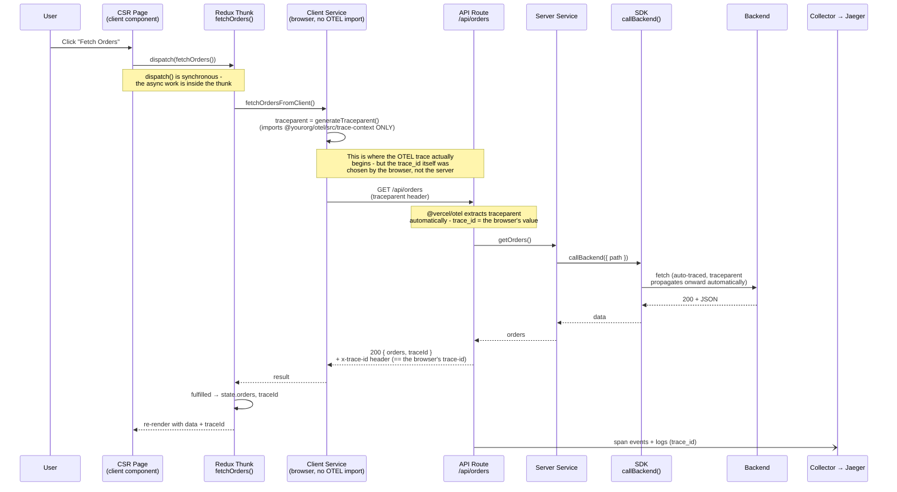
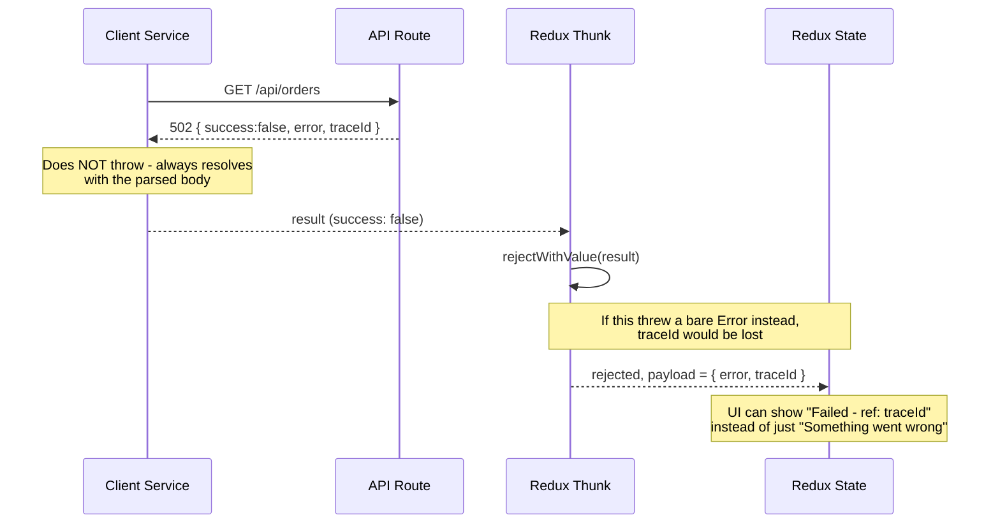
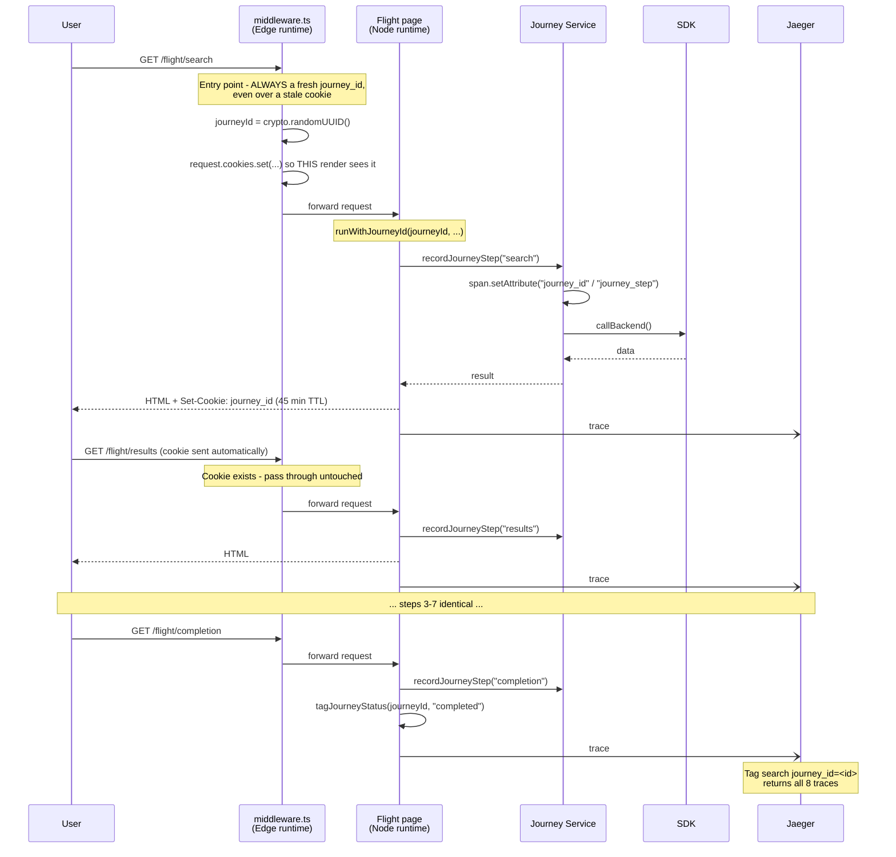
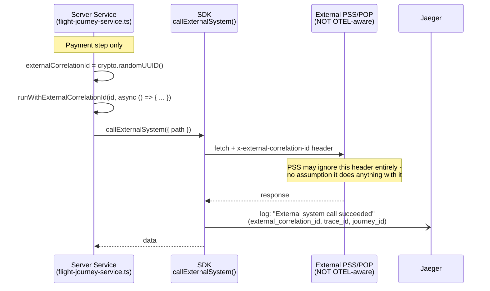

# 🏛️ Architecture: OTEL Tracing Across SSR & CSR

This is the architecture-level reference for how observability was built into
this monorepo — the diagrams, the decisions behind them, and a checklist for
carrying the same pattern into a real production project. For step-by-step
setup instructions, see `OTEL_COMPLETE_IMPLEMENTATION_GUIDE.md`; for a
hands-on verification walkthrough, see `SSR_CSR_TRACING_DEMO.md`. This doc
is the "why it's shaped this way" companion to both.

---

## 1. System Overview

> **Revision note:** this section originally described a custom
> `x-correlation-id` header for the browser→server boundary. That's been
> superseded by **client-generated `traceparent`** (§1a below) — the
> custom correlation mechanism (`packages/otel/src/external-correlation.ts`)
> still exists, but is now scoped specifically to calls that leave our own
> systems entirely (external vendors like a PSS/POP integration). See
> Decision 1 (superseded) and Decision 8 in §5.



**Three identifiers travel through requests, for three different reasons:**

| ID | Created by | Exists for | Carried via |
|---|---|---|---|
| `trace_id` | Client-generated `traceparent` (browser/SSR) or OTEL itself if none was sent | The whole controlled chain: browser → API route → server service → sdk → **our own backend** | The W3C `traceparent` HTTP header — a real OTEL trace, not a custom field |
| `external_correlation_id` | Our own code, immediately before calling an **external, uncontrolled** system | Only that one outbound call to a vendor system that may not run OTEL at all | A plain `x-external-correlation-id` header, our own `AsyncLocalStorage` (`packages/otel/src/external-correlation.ts`) |
| `journey_id` | `middleware.ts`, once, at a flow's entry point | An entire multi-page flow spanning many separate traces (§4) | A cookie |

The key shift from the original design: `trace_id` is no longer purely
server-generated. A hand-formatted `traceparent` header, sent from the
browser or an SSR page with **no browser OTEL SDK involved**, becomes the
literal `trace_id` Jaeger records — verified directly against this repo
(§1a). `external_correlation_id` exists for exactly the one case
`traceparent` can't help with: a vendor system we don't control and can't
assume will honor W3C trace context at all.

---

## 1a. Why `traceparent` Instead of a Custom Header

### The mechanism

W3C Trace Context extraction doesn't require the sender to be a "real"
participating tracer — it just reads a correctly-formatted header and
treats it as a remote parent. This means the browser can hand-format a
spec-compliant value using nothing but `crypto.randomUUID()` (no OTEL
library needed client-side), and `@vercel/otel`'s existing Node HTTP
auto-instrumentation extracts it **automatically, with zero code change on
the server**.

```
traceparent: 00-4bf92f3577b34da6a3ce929d0e0e4736-00f067aa0ba902b7-01
             │  └────────trace-id (32 hex)────────┘ └parent-id(16)┘ └flags┘
          version
```

### Verified, not assumed

Before wiring this into any UI code, this was tested directly against the
running app:

```bash
curl -s -D - http://localhost:3000/api/orders \
  -H "traceparent: 00-4bf92f3577b34da6a3ce929d0e0e4736-00f067aa0ba902b7-01"
# x-trace-id: 4bf92f3577b34da6a3ce929d0e0e4736   ← EXACTLY the hand-crafted trace-id
```

Querying Jaeger for that exact trace-id returned a **fully populated
trace** — 5 spans, including the SDK's outbound fetch to the backend — all
under the hand-crafted ID. No real OTEL SDK ever ran client-side to
produce it.

### What this replaces

| | Before (`correlation_id`) | Now (`traceparent`) |
|---|---|---|
| Header | Custom `x-correlation-id` | W3C standard `traceparent` |
| What Jaeger does with it | Nothing — a plain string we searched manually | **Becomes the actual `trace_id`** |
| Crosses into our own Java backend | Only with custom code on both sides | **Automatically** — any OTEL-instrumented service extracts it by default |
| One Jaeger view of Next.js + Java together | No — two systems, manually cross-referenced | **Yes** — one continuous trace |

### The browser-safety mechanism

`generateTraceparent()` lives in `packages/otel/src/trace-context.ts` —
deliberately dependency-free (just `crypto.randomUUID()`), and imported by
browser code via its **direct subpath** (`@yourorg/otel/src/trace-context`),
never through the package's main entry. The main entry (`index.ts`)
eagerly imports `@vercel/otel`, which is Node-only — importing anything
from it in a browser bundle risks the same class of failure as the
Edge-runtime bug in §4. Confirmed after the change: the `/orders` CSR
page's bundle size barely moved (1.09 kB → 1.1 kB), meaning the Node-only
code stayed out of the browser bundle.

---

## 2. SSR Sequence



**Key property verified in practice:** because the SSR page's self-fetch to
`/api/orders` is itself an instrumented `fetch` call, Next.js keeps it in
the **same trace** as the API route it calls — confirmed in Jaeger as
`fetch GET http://localhost:3000/api/orders` → `GET \api\orders\route` →
`executing api route (app) \api\orders\route`, all one trace ID, all one
depth-6 waterfall.

---

## 3. CSR Sequence



### Failure path (why `rejectWithValue` matters)



---

## 4. Multi-Page Journeys (`journey_id`)

Everything above covers a **single request**. A real booking flow —
flight search → results → seats → passengers → extras → review → payment →
completion — is 8 separate page loads, and therefore **8 separate OTEL
traces**. Neither `trace_id` nor `correlation_id` spans them: both are
bounded to one request by design.

`journey_id` is the third identifier, with a third lifecycle:

| ID | Scope | Regenerated | Answers |
|---|---|---|---|
| `trace_id` | One request | Every request (by OTEL) | "What happened inside *this* request?" |
| `correlation_id` | One browser→server round trip | Every call | "Which server work belongs to *this* fetch?" |
| **`journey_id`** | **The whole 8-step flow** | **Once, at flow entry** | **"Show me everything from this customer's booking attempt"** |



### Why a cookie, and why middleware

Since these are real page navigations (not SPA routing), `journey_id` must
be readable **synchronously, server-side, on the first byte of every page** —
including pages that fetch data during SSR before any client JS runs. That
rules out `sessionStorage` (client-only). A cookie works, but Next.js
Server Components **cannot set cookies** — only Route Handlers, Server
Actions, and middleware can. Hence `middleware.ts`.

The subtle part: middleware mutates **`request.cookies`**, not just the
response. Setting only the response cookie would mean the very page being
rendered right now still can't see it — `cookies()` reads the *incoming*
request. Mutating the request is what lets the entry page's own first
render read the ID it was just assigned.

### The Edge-runtime constraint

Middleware runs on the Edge runtime, which has **no `async_hooks`** — so
`middleware.ts` cannot import `@yourorg/otel` at all (both `correlation.ts`
and `journey.ts` depend on `AsyncLocalStorage`). It does pure cookie logic
only; all tracing and logging happens once the request reaches a
Node-runtime page.

This constraint bit once during implementation: adding `middleware.ts`
caused Next.js to *also* invoke `instrumentation.ts`'s `register()` on the
Edge runtime, where `@vercel/otel` isn't safe to load — it threw
`Cannot read properties of undefined (reading 'attributeCountLimit')`. The
fix is the `process.env.NEXT_RUNTIME === "nodejs"` guard now in both apps'
`instrumentation.ts`.

### Span attribute, not log field

`external_correlation_id` (§4a below) is attached to spans as a **log-event
field** (`span.addEvent(..., { "log.external_correlation_id": id })`).
That's fine when you already have the trace open. But Jaeger's tag search
matches **span tags**, not nested log-event fields — so `journey_id` is set
via `span.setAttribute()` instead. That single difference is what makes
`tags={"journey_id":"<id>"}` return all 8 traces rather than nothing.

Each page also tags `journey_step`, and the terminal page tags
`journey_status=completed`. Beyond debugging one booking, that combination
makes drop-off analysis queryable: count distinct `journey_id`s with
`journey_step=payment` versus `journey_step=seats`.

---

## 4a. The External System Boundary (PSS/POP)

Everything above — `traceparent`, `journey_id` — assumes both ends of a
call run OTEL and cooperate with trace context. That assumption breaks the
moment a request leaves to a **vendor system we don't control**: an airline
PSS (Passenger Service System), a POP integration, a payment gateway. These
almost certainly don't run OTEL, and won't extract or forward a
`traceparent` header the way our own services do.



### Why this can't just be `traceparent` too

If PSS doesn't read `traceparent`, sending it accomplishes nothing on their
end — no harm, but no benefit either. What actually matters is that **our
own** request/response logs durably record "we sent PSS this exact ID, on
this exact call, at this exact time" — regardless of what PSS does with it.
That's a plain custom header doing a plain job: a breadcrumb on our side,
not a distributed-tracing mechanism.

### Why it's a separate module from `journey_id`

Both `external-correlation.ts` and `journey.ts` use the same
`AsyncLocalStorage` pattern, but their scopes don't overlap:
`external_correlation_id` is scoped to **one outbound call** (regenerated
each time, like the old `correlation_id` was); `journey_id` is scoped to
**the whole multi-page flow** (generated once, reused for hours). Keeping
them as separate modules keeps that distinction obvious in the code, not
just in a comment.

### Where this lives in the demo

`packages/sdk/src/index.ts` exports two functions with different
contracts:
- `callBackend()` — our own backend (Java, in a real deployment). No
  correlation code at all — `traceparent` propagation is automatic.
- `callExternalSystem()` — the PSS/POP stand-in. Explicitly reads
  `getExternalCorrelationId()` and sends it as `x-external-correlation-id`.

`flight-journey-service.ts`'s payment step is the one place both are called
side by side, so the difference is visible directly in the code and in
Jaeger (two separate outbound fetch spans, one with the header, one
without).

---

## 5. Decisions Behind This Shape

Eight decisions define why the architecture looks like this rather than the
more obvious alternatives. Each was made explicitly, not by default.

### Decision 1 — Correlation ID vs. full browser tracing (SUPERSEDED — see below)

**Original rejected alternative:** load `@opentelemetry/sdk-trace-web` +
fetch instrumentation in the browser, so the trace genuinely starts at the
Redux dispatch.

**Original reasoning:** that costs client bundle size on every page, needs
CORS configuration on the collector (browser calls are cross-origin, unlike
server→collector which is same docker network), and requires exposing the
collector endpoint publicly instead of keeping it on `localhost`/internal
network only. **What we did at the time:** a plain `crypto.randomUUID()` in
the client service, forwarded as `x-correlation-id`.

**Why this decision was revisited:** the original framing missed a middle
option — you don't need a full browser tracer SDK to get a *real* trace_id
from the browser. W3C Trace Context extraction doesn't require the sender
to be a genuine OTEL participant; a hand-formatted `traceparent` header
works too, and `@vercel/otel`'s existing server-side auto-instrumentation
already extracts it with zero code change (verified in §1a). This keeps
every original concern addressed — no browser bundle cost, no CORS/collector
exposure — while upgrading the outcome from "a custom field we search
manually" to "the actual trace_id, native to Jaeger, continuing
automatically into our own Java backend too."

**Current state:** `x-correlation-id` no longer exists for this boundary.
The client sends `traceparent` instead (§1a). The `correlation.ts` module
was renamed to `external-correlation.ts` and rescoped — see Decision 8.

### Decision 2 — Auto instrumentation vs. manual spans in the SDK (chosen: auto)

**Rejected alternative:** wrap every `sdk` method in
`tracer.startActiveSpan("sdk.getOrders", ...)` for richer, domain-named
spans.

**Why not:** it's extra code in every SDK method for a benefit (nicer span
names) that logging already covers — `logger.info("Calling backend", { url
})` gives the same operational context.

**What we did instead:** `callBackend()` just uses the global `fetch`, which
`@vercel/otel`'s Node auto-instrumentation already wraps in a span with zero
extra code. Verified live: the outbound call to the backend shows up as
`fetch GET https://...` nested under the API route span, same trace ID,
automatically.

### Decision 3 — SSR and CSR both go through the same API route (not two code paths)

Both call patterns hit `/api/orders`. The SSR page does a real HTTP
self-fetch rather than importing the server service directly. This means:
- One place to read/generate the correlation ID, one place to set response
  headers, one place to catch and log errors — not duplicated per caller.
- The tradeoff: SSR pays for a real network round-trip to itself instead of
  a direct function call. For this demo that's an acceptable cost; a
  latency-sensitive real project might instead let SSR call the server
  service directly and only have CSR go through the API route. That's a
  legitimate variation on this pattern — the correlation ID and logging
  approach are unaffected either way.

### Decision 4 — Exception recording is explicit, not automatic

`logger.error(message, attributes, error)` takes the caught error as a
**third argument**, which calls `span.recordException(error)` +
`span.setStatus({ code: ERROR })`. Without passing it, the span still shows
as normal "OK" in Jaeger even though the request failed — only a log event
would hint at the problem. This was a deliberate fix (see git history:
"Add trace correlation, exception recording, and OTEL Collector") after
noticing failed requests didn't visually stand out in the trace waterfall.

### Decision 5 — An OTEL Collector sits between apps and Jaeger

Apps send OTLP to `localhost:4317` — that port used to be Jaeger's, now it's
the collector's, which forwards to `jaeger:4317` internally. Nothing in app
code or `.env.local` changed to make this swap. The reason: to change or add
a trace backend (Datadog, CloudWatch, a second Jaeger for a different
environment) later, only `otel-collector-config.yaml` needs to change.

### Decision 6 — Cookie vs. URL param for `journey_id` (chosen: cookie)

**Rejected alternative:** carry `journey_id` as a query parameter forwarded
through every link and redirect between the 8 steps.

**Why not:** it's naturally tab-scoped (a real advantage — two tabs booking
simultaneously wouldn't collide), but it means every one of the 8 pages'
links, forms, and redirects must remember to forward it. One missed link
anywhere in the flow silently breaks the chain for that user, with no
error to signal it happened.

**Why cookie instead:** the browser forwards it automatically on every
same-origin request — nothing to remember per link. The real cost is a
narrow edge case: two tabs starting a booking simultaneously would share
one `journey_id`, since cookies aren't tab-scoped. Confirmed acceptable
for this project since there's no realistic concurrent-tab booking
scenario; worth revisiting if that changes.

### Decision 7 — `journey_id` as a span attribute, not a log field

`external_correlation_id` is attached to spans via
`span.addEvent(..., { "log.external_correlation_id": id })` — sufficient
once you already have one trace open, since you're reading event details
inside it. `journey_id` needs something stronger: the entire point is
finding traces you *don't* already have open, across 8 separate ones.
Jaeger's tag search matches span-level tags, not fields buried inside log
events — so `journey_id` is set via `span.setAttribute()` instead. Verified
directly: querying Jaeger's API with `tags={"journey_id":"<id>"}` returned
all 8 traces only after switching to `setAttribute`; the event-only
approach would have returned nothing outside a specific trace already
known.

### Decision 8 — Keep a custom correlation ID, but only for uncontrolled external systems

**Why not delete `correlation_id` entirely once `traceparent` was
adopted:** because `traceparent` only earns its value when *both* ends
extract and honor it. A vendor PSS/POP integration almost certainly
doesn't run OTEL — sending it `traceparent` is harmless but produces no
benefit, since nothing on their end will act on it or continue the trace.

**What we did instead:** kept the exact same mechanism (`AsyncLocalStorage`,
generated fresh per call, forwarded as a header) but renamed and rescoped
it — `correlation.ts` → `external-correlation.ts`,
`runWithCorrelationId`/`getCorrelationId` →
`runWithExternalCorrelationId`/`getExternalCorrelationId`, header
`x-correlation-id` → `x-external-correlation-id`. It's now used in exactly
one place: `callExternalSystem()` in `packages/sdk`, called from the
flight flow's payment step (§4a) to simulate a PSS/POP call. The rename
matters as much as the code — `correlation_id` meaning "browser→our
server" and then silently meaning "our server→external vendor" without a
name change would have been confusing to anyone reading logs from both
eras of this codebase.

---

## 6. How This Was Actually Built (Chronological)

For context on *why* the code looks the way it does, roughly in the order
decisions were made:

1. **Base setup** — `@vercel/otel` + `instrumentation.ts` + Jaeger via
   `docker-compose`. Hit and fixed a `Module not found: Can't resolve 'fs'`
   error caused by `@opentelemetry/resource-detector-aws` being bundled into
   a client-facing path — removed the AWS detector, since it wasn't needed
   for local Jaeger tracing anyway.

2. **Structured logging** — `createLogger()` added to `packages/otel`, with
   dual output (console + Jaeger span event) from the start, so development
   and production had different needs met by one function call.

3. **Found and fixed a visibility gotcha** — log events attach to the
   *innermost* active span (`executing api route (app) ...`), not the outer
   request span (`GET \api\...\route`). This tripped up verification
   multiple times during development — worth remembering when debugging any
   new endpoint.

4. **Production log format** — switched to JSON Lines
   (`NODE_ENV=production`) so logs are one parseable JSON object per line,
   compatible with CloudWatch/Datadog, instead of the pretty-printed
   multi-line format used for local development.

5. **Closed the high-priority observability gaps** — trace ID in
   response headers + log lines (Decision-adjacent to correlation ID, but
   for the *server-side* trace specifically), exception recording
   (Decision 4), and the OTEL Collector (Decision 5) — all added together
   once the basic logging pipeline was proven to work.

6. **Extended to the real SSR/CSR/Redux shape** — this is where
   Decisions 1–3 came in, once it was clear the demo needed to reflect an
   actual production request pattern (client service / server service / sdk
   / Redux dispatch) rather than a single flat API route.

7. **Extended again to a multi-page journey** — Decisions 6–7 and the
   `journey_id` mechanism, once it was clear a real booking flow spans many
   page loads, not one request. Hit and fixed an Edge-runtime bug here too:
   adding `middleware.ts` made Next.js invoke `instrumentation.ts`'s
   `register()` on Edge as well as Node, where `@vercel/otel` isn't safe to
   load — fixed with the `NEXT_RUNTIME === "nodejs"` guard.

8. **Revisited Decision 1 once a polyglot backend entered the picture** —
   once a separate Java backend needed its own OTEL rollout, the original
   `x-correlation-id` design stopped being the best answer for the
   browser→server boundary: a real distributed trace spanning Next.js *and*
   Java, via standard `traceparent` propagation, was achievable without a
   browser tracer SDK after all (§1a). Verified the core assumption with a
   hand-crafted `traceparent` header before writing any UI code. This also
   surfaced a real, separate problem `traceparent` *doesn't* solve: calls to
   external vendor systems (PSS/POP) that don't run OTEL at all — which is
   what the renamed `external-correlation.ts` and `callExternalSystem()`
   (§4a) exist for.

---

## 7. Implementing This in a Real Project

A checklist for carrying this pattern into an actual production codebase,
not just this demo repo.

### Rename the shared packages
`@yourorg/otel` and `@yourorg/sdk` are placeholder scopes. Rename them to
your actual npm/org scope before this leaves demo status — the pattern
(shared `createLogger`, `getTraceContext`, `generateTraceparent`,
`callBackend`) stays identical either way.

### Point at your real backend
`packages/sdk`'s `BACKEND_BASE_URL` currently defaults to a public demo API
(`jsonplaceholder.typicode.com`). Set the real one via environment variable
— no code changes needed in the SDK itself.

### Point at your real trace backend
Edit `otel-collector-config.yaml`'s `exporters` section to add/replace
Jaeger with whatever your organization actually uses (Datadog, Honeycomb,
CloudWatch via the AWS OTEL exporter, etc.) — apps and `.env.local` are
unaffected by this change.

### Reuse the pattern everywhere, not just `/api/orders`
Every new API route in a real project should follow the same shape — and
notice it's now *simpler* than the old correlation-id version, since
`@vercel/otel` already extracted `traceparent` before your handler runs:
```typescript
export async function GET(request: NextRequest) {
  const traceId = getTraceContext()?.traceId; // already the caller's trace-id, if they sent traceparent
  // ... logger.info/error, response headers
}
```
If any hop in this route calls an **external, uncontrolled** system, wrap
just that call:
```typescript
const externalCorrelationId = crypto.randomUUID();
await runWithExternalCorrelationId(externalCorrelationId, async () => {
  await callExternalSystem({ path });
});
```

### Keep the browser/server boundary strict
Never import `@yourorg/otel`'s main entry (or anything using `async_hooks`)
from a file that runs in the browser — `orders-client-service.ts` is the
template for that boundary. The one thing that IS safe to import from the
browser is `@yourorg/otel/src/trace-context` (the `generateTraceparent()`
subpath), specifically because it has zero Node dependencies. If a future
client service needs logging, use a lightweight browser-safe logger, not
`createLogger`.

### Decide the SSR self-fetch question per project
Decision 3 above notes a real tradeoff: SSR self-fetching its own API route
costs a network round-trip. For a latency-sensitive page, consider having
SSR call the server service directly (in-process, no HTTP hop) and reserve
the API route purely for CSR. If you do this, the SSR page needs to
generate its own `traceparent` (via `generateTraceparent()`) and pass it
along however the direct call needs it, since there's no API route
extracting it for you in that path.

### Instrumenting the Java backend (or any other polyglot service)
This is what actually makes `traceparent` worth adopting — see §1a and
Decision 1. The natural counterpart to `@vercel/otel`'s auto-instrumentation
is the **OpenTelemetry Java Agent**:
```bash
java -javaagent:opentelemetry-javaagent.jar \
  -Dotel.service.name=java-backend \
  -Dotel.exporter.otlp.endpoint=http://<collector-host>:4317 \
  -jar your-app.jar
```
Zero custom Java code required — the agent auto-instruments common
frameworks (Spring, servlets, JDBC) and, critically, **auto-extracts
incoming `traceparent` headers by default**, continuing the exact trace
`callBackend()`'s outbound fetch carries. Point it at the same OTEL
Collector this repo already runs (§5 Decision 5) — a Java service is just
another OTLP producer, no collector architecture change needed. Do this
alongside the resource-attributes item below: consistent `service.name`/
`deployment.environment` conventions matter more, not less, once multiple
languages feed one Jaeger instance.

### The external-system boundary is a checklist item on its own
Before assuming any given integration can use `traceparent`, confirm the
far side actually runs OTEL. If it's a vendor system you don't control
(payment gateway, PSS/GDS, any third-party API) — use the
`callExternalSystem()` pattern (§4a) instead: a plain custom header, purely
for your own request/response logs, no assumption the vendor does anything
with it.

### Add resource attributes before going to production
Not yet in this repo: `service.version`, `deployment.environment`
(dev/staging/prod), `host.name`. Without these, you can't filter "only prod
errors from v1.2.3" in your trace backend. Add them in
`packages/otel/src/index.ts`'s `registerOTel()` call.

### Add sampling before real traffic volume
`traceExporter: "auto"` traces every request. Fine for this demo's traffic,
expensive at production scale. Add `OTEL_TRACES_SAMPLER=parentbased_traceidratio`
with a sane ratio, while ensuring errors are always sampled regardless
(most collectors support tail-based sampling for exactly this).

### Verify new endpoints the same way
Use `SSR_CSR_TRACING_DEMO.md` as the checklist template for any new
endpoint built on this pattern — same steps (direct curl, SSR page, CSR
DevTools check, Jaeger cross-check, terminal logs, deliberate failure)
apply regardless of the domain.

### Applying `journey_id` to your actual multi-step flow
- Set the middleware `matcher` to your real flow's route prefix (e.g.
  `/checkout/:path*`, `/onboarding/:path*`) — it currently matches
  `/flight/:path*`.
- Decide your real entry-point path (the one that always regenerates,
  never reuses a stale cookie) — currently hardcoded to `/flight/search`.
- Reconsider the cookie TTL (currently 45 min) against how long your real
  flow realistically takes to complete.
- If any step in your real flow redirects to a genuinely external domain
  (a payment gateway, an identity provider) and back, revisit
  `SameSite=Lax` — a cross-site round trip may need `SameSite=None; Secure`
  instead, which has its own browser-compatibility caveats worth testing
  explicitly rather than assuming.
- `journey_id` and `journey_step`/`journey_status` are plain random UUIDs
  and business labels — not PII themselves — but confirm that's still true
  for your real step names before shipping (e.g. don't let a step name leak
  a customer identifier).

---

## Quick Reference

| Concept | Where it's defined | Where it's used |
|---|---|---|
| `createLogger(name)` | `packages/otel/src/log-helper.ts` | Every layer: API route, server service, sdk |
| `getTraceContext()` | `packages/otel/src/log-helper.ts` | API route (response headers), anywhere needing the trace ID |
| `generateTraceparent()` | `packages/otel/src/trace-context.ts` (import via `/src/trace-context` subpath — browser-safe) | `orders-client-service.ts` (browser), `orders-ssr/page.tsx` |
| `runWithExternalCorrelationId(id, fn)` | `packages/otel/src/external-correlation.ts` | Wraps only the call to an external system, e.g. in `flight-journey-service.ts`'s payment step |
| `getExternalCorrelationId()` | `packages/otel/src/external-correlation.ts` | Read implicitly by `createLogger`, explicitly by `callExternalSystem()` |
| `runWithJourneyId(id, fn)` | `packages/otel/src/journey.ts` | Wraps each flight-flow page's render |
| `getJourneyId()` | `packages/otel/src/journey.ts` | Read implicitly by `createLogger` |
| `tagJourneyStep(id, step)` / `tagJourneyStatus(id, status)` | `packages/otel/src/journey.ts` | Called once per page, in `flight-journey-service.ts` / `render-step.tsx` |
| `callBackend(opts)` | `packages/sdk/src/index.ts` | Server service → OUR OWN backend (e.g. Java) — traceparent propagates automatically, no correlation code |
| `callExternalSystem(opts)` | `packages/sdk/src/index.ts` | Server service → an EXTERNAL vendor (PSS/POP) — explicit `x-external-correlation-id` header |
| `journey_id` cookie logic | `apps/ibe-app/middleware.ts` | Runs before every `/flight/*` page (Edge runtime) |
| OTEL Collector config | `otel-collector-config.yaml` | The one place to change when swapping trace backends, or adding a Java service as another OTLP producer |
