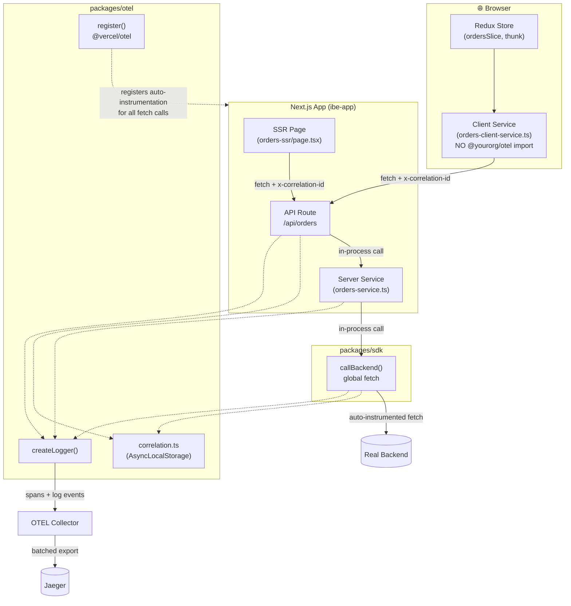
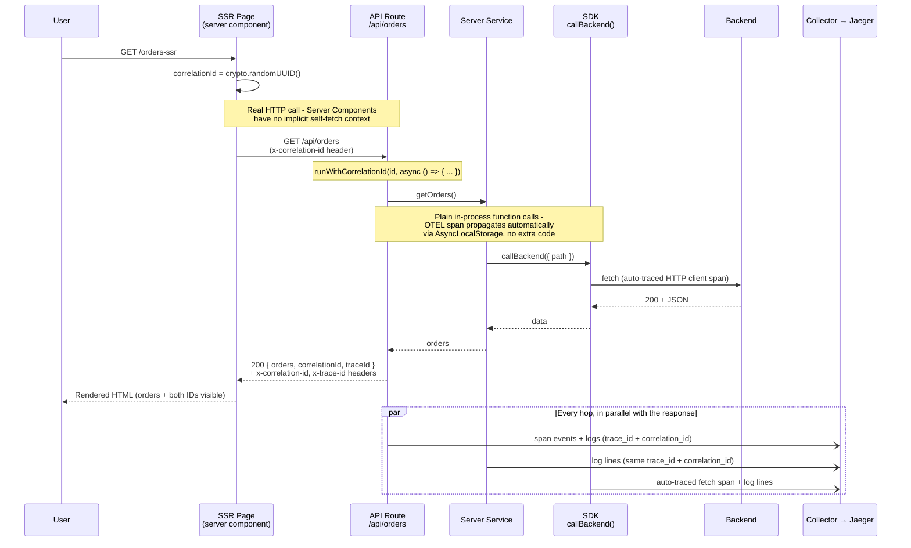
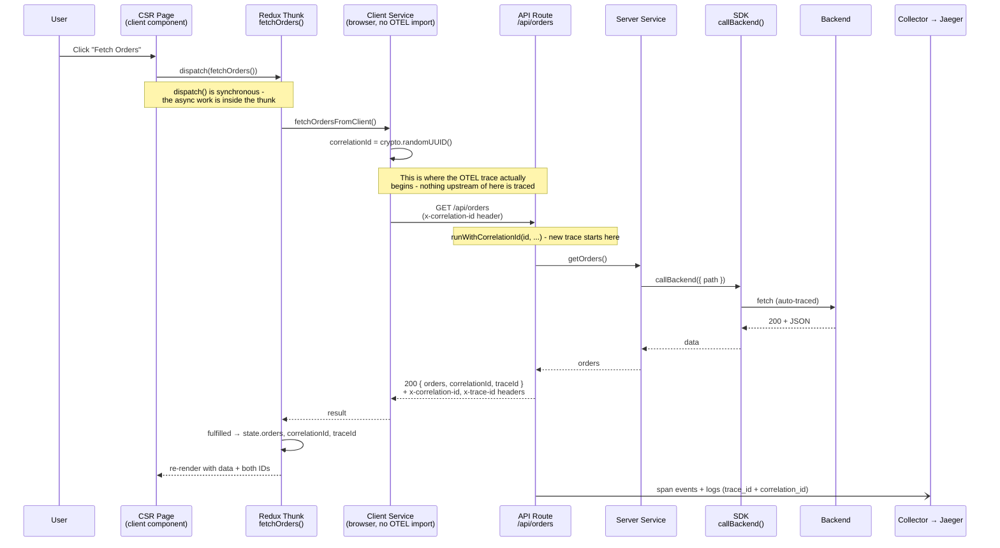
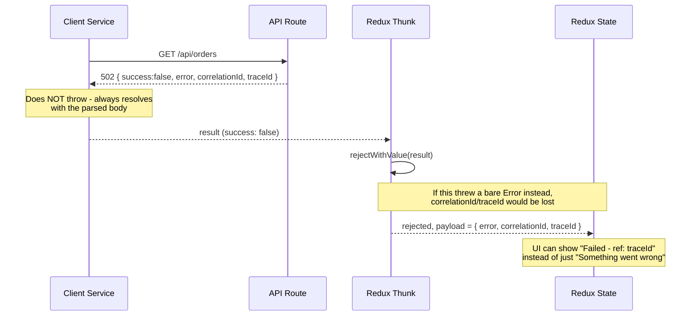
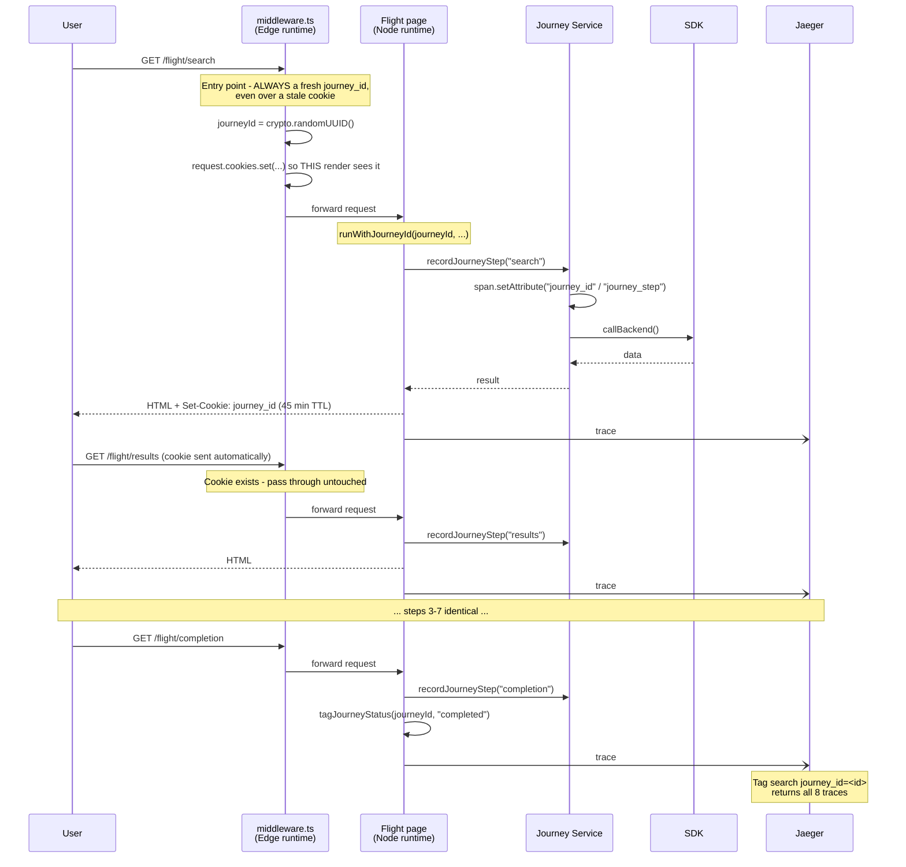

# 🏛️ Architecture: OTEL Tracing Across SSR & CSR

This is the architecture-level reference for how observability was built into
this monorepo — the diagrams, the decisions behind them, and a checklist for
carrying the same pattern into a real production project. For step-by-step
setup instructions, see `OTEL_COMPLETE_IMPLEMENTATION_GUIDE.md`; for a
hands-on verification walkthrough, see `SSR_CSR_TRACING_DEMO.md`. This doc
is the "why it's shaped this way" companion to both.

---

## 1. System Overview



**Two identifiers travel through every request, for different reasons:**

| ID | Created by | Exists for | Carried via |
|---|---|---|---|
| `trace_id` | OTEL, automatically, the moment a span opens | Server-side spans: API route → server service → sdk → backend | OTEL's own context propagation (`AsyncLocalStorage` inside `@opentelemetry/api`) |
| `correlation_id` | Our own code, at the true origin of the request | Everything, including the parts OTEL can't see (the browser) | A plain `x-correlation-id` HTTP header, read via our own `AsyncLocalStorage` (`packages/otel/src/correlation.ts`) |

The `trace_id` only exists once a request reaches an instrumented server
span — it **cannot** originate in the browser here, because there's no OTEL
SDK loaded client-side (see §4, Decision 2). The `correlation_id` exists
specifically to cover that gap.

---

## 2. SSR Sequence



**Key property verified in practice:** because the SSR page's self-fetch to
`/api/orders` is itself an instrumented `fetch` call, Next.js keeps it in
the **same trace** as the API route it calls — confirmed in Jaeger as
`fetch GET http://localhost:3000/api/orders` → `GET \api\orders\route` →
`executing api route (app) \api\orders\route`, all one trace ID, all one
depth-6 waterfall.

---

## 3. CSR Sequence



### Failure path (why `rejectWithValue` matters)



---

## 4. Multi-Page Journeys (`journey_id`)

Everything above covers a **single request**. A real booking flow —
flight search → results → seats → passengers → extras → review → payment →
completion — is 8 separate page loads, and therefore **8 separate OTEL
traces**. Neither `trace_id` nor `correlation_id` spans them: both are
bounded to one request by design.

`journey_id` is the third identifier, with a third lifecycle:

| ID | Scope | Regenerated | Answers |
|---|---|---|---|
| `trace_id` | One request | Every request (by OTEL) | "What happened inside *this* request?" |
| `correlation_id` | One browser→server round trip | Every call | "Which server work belongs to *this* fetch?" |
| **`journey_id`** | **The whole 8-step flow** | **Once, at flow entry** | **"Show me everything from this customer's booking attempt"** |



### Why a cookie, and why middleware

Since these are real page navigations (not SPA routing), `journey_id` must
be readable **synchronously, server-side, on the first byte of every page** —
including pages that fetch data during SSR before any client JS runs. That
rules out `sessionStorage` (client-only). A cookie works, but Next.js
Server Components **cannot set cookies** — only Route Handlers, Server
Actions, and middleware can. Hence `middleware.ts`.

The subtle part: middleware mutates **`request.cookies`**, not just the
response. Setting only the response cookie would mean the very page being
rendered right now still can't see it — `cookies()` reads the *incoming*
request. Mutating the request is what lets the entry page's own first
render read the ID it was just assigned.

### The Edge-runtime constraint

Middleware runs on the Edge runtime, which has **no `async_hooks`** — so
`middleware.ts` cannot import `@yourorg/otel` at all (both `correlation.ts`
and `journey.ts` depend on `AsyncLocalStorage`). It does pure cookie logic
only; all tracing and logging happens once the request reaches a
Node-runtime page.

This constraint bit once during implementation: adding `middleware.ts`
caused Next.js to *also* invoke `instrumentation.ts`'s `register()` on the
Edge runtime, where `@vercel/otel` isn't safe to load — it threw
`Cannot read properties of undefined (reading 'attributeCountLimit')`. The
fix is the `process.env.NEXT_RUNTIME === "nodejs"` guard now in both apps'
`instrumentation.ts`.

### Span attribute, not log field

`correlation_id` is attached to spans as a **log-event field**
(`span.addEvent(..., { "log.correlation_id": id })`). That's fine when you
already have the trace open. But Jaeger's tag search matches **span tags**,
not nested log-event fields — so `journey_id` is set via
`span.setAttribute()` instead. That single difference is what makes
`tags={"journey_id":"<id>"}` return all 8 traces rather than nothing.

Each page also tags `journey_step`, and the terminal page tags
`journey_status=completed`. Beyond debugging one booking, that combination
makes drop-off analysis queryable: count distinct `journey_id`s with
`journey_step=payment` versus `journey_step=seats`.

---

## 5. Decisions Behind This Shape

Seven decisions define why the architecture looks like this rather than the
more obvious alternatives. Each was made explicitly, not by default.

### Decision 1 — Correlation ID vs. full browser tracing (chosen: correlation ID)

**Rejected alternative:** load `@opentelemetry/sdk-trace-web` +
fetch instrumentation in the browser, so the trace genuinely starts at the
Redux dispatch.

**Why not:** it costs client bundle size on every page, needs CORS
configuration on the collector (browser calls are cross-origin, unlike
server→collector which is same docker network), and requires exposing the
collector endpoint publicly instead of keeping it on `localhost`/internal
network only.

**What we did instead:** a plain `crypto.randomUUID()` in the client
service, forwarded as `x-correlation-id`. The "real" OTEL trace still starts
at the API route, but the correlation ID lets a user-reported error be tied
back to its origin regardless.

### Decision 2 — Auto instrumentation vs. manual spans in the SDK (chosen: auto)

**Rejected alternative:** wrap every `sdk` method in
`tracer.startActiveSpan("sdk.getOrders", ...)` for richer, domain-named
spans.

**Why not:** it's extra code in every SDK method for a benefit (nicer span
names) that logging already covers — `logger.info("Calling backend", { url
})` gives the same operational context.

**What we did instead:** `callBackend()` just uses the global `fetch`, which
`@vercel/otel`'s Node auto-instrumentation already wraps in a span with zero
extra code. Verified live: the outbound call to the backend shows up as
`fetch GET https://...` nested under the API route span, same trace ID,
automatically.

### Decision 3 — SSR and CSR both go through the same API route (not two code paths)

Both call patterns hit `/api/orders`. The SSR page does a real HTTP
self-fetch rather than importing the server service directly. This means:
- One place to read/generate the correlation ID, one place to set response
  headers, one place to catch and log errors — not duplicated per caller.
- The tradeoff: SSR pays for a real network round-trip to itself instead of
  a direct function call. For this demo that's an acceptable cost; a
  latency-sensitive real project might instead let SSR call the server
  service directly and only have CSR go through the API route. That's a
  legitimate variation on this pattern — the correlation ID and logging
  approach are unaffected either way.

### Decision 4 — Exception recording is explicit, not automatic

`logger.error(message, attributes, error)` takes the caught error as a
**third argument**, which calls `span.recordException(error)` +
`span.setStatus({ code: ERROR })`. Without passing it, the span still shows
as normal "OK" in Jaeger even though the request failed — only a log event
would hint at the problem. This was a deliberate fix (see git history:
"Add trace correlation, exception recording, and OTEL Collector") after
noticing failed requests didn't visually stand out in the trace waterfall.

### Decision 5 — An OTEL Collector sits between apps and Jaeger

Apps send OTLP to `localhost:4317` — that port used to be Jaeger's, now it's
the collector's, which forwards to `jaeger:4317` internally. Nothing in app
code or `.env.local` changed to make this swap. The reason: to change or add
a trace backend (Datadog, CloudWatch, a second Jaeger for a different
environment) later, only `otel-collector-config.yaml` needs to change.

### Decision 6 — Cookie vs. URL param for `journey_id` (chosen: cookie)

**Rejected alternative:** carry `journey_id` as a query parameter forwarded
through every link and redirect between the 8 steps.

**Why not:** it's naturally tab-scoped (a real advantage — two tabs booking
simultaneously wouldn't collide), but it means every one of the 8 pages'
links, forms, and redirects must remember to forward it. One missed link
anywhere in the flow silently breaks the chain for that user, with no
error to signal it happened.

**Why cookie instead:** the browser forwards it automatically on every
same-origin request — nothing to remember per link. The real cost is a
narrow edge case: two tabs starting a booking simultaneously would share
one `journey_id`, since cookies aren't tab-scoped. Confirmed acceptable
for this project since there's no realistic concurrent-tab booking
scenario; worth revisiting if that changes.

### Decision 7 — `journey_id` as a span attribute, not a log field

`correlation_id` is attached to spans via `span.addEvent(..., { "log.correlation_id": id })`
— sufficient once you already have one trace open, since you're reading
event details inside it. `journey_id` needs something stronger: the entire
point is finding traces you *don't* already have open, across 8 separate
ones. Jaeger's tag search matches span-level tags, not fields buried
inside log events — so `journey_id` is set via `span.setAttribute()`
instead. Verified directly: querying Jaeger's API with
`tags={"journey_id":"<id>"}` returned all 8 traces only after switching to
`setAttribute`; the event-only approach would have returned nothing outside
a specific trace already known.

---

## 6. How This Was Actually Built (Chronological)

For context on *why* the code looks the way it does, roughly in the order
decisions were made:

1. **Base setup** — `@vercel/otel` + `instrumentation.ts` + Jaeger via
   `docker-compose`. Hit and fixed a `Module not found: Can't resolve 'fs'`
   error caused by `@opentelemetry/resource-detector-aws` being bundled into
   a client-facing path — removed the AWS detector, since it wasn't needed
   for local Jaeger tracing anyway.

2. **Structured logging** — `createLogger()` added to `packages/otel`, with
   dual output (console + Jaeger span event) from the start, so development
   and production had different needs met by one function call.

3. **Found and fixed a visibility gotcha** — log events attach to the
   *innermost* active span (`executing api route (app) ...`), not the outer
   request span (`GET \api\...\route`). This tripped up verification
   multiple times during development — worth remembering when debugging any
   new endpoint.

4. **Production log format** — switched to JSON Lines
   (`NODE_ENV=production`) so logs are one parseable JSON object per line,
   compatible with CloudWatch/Datadog, instead of the pretty-printed
   multi-line format used for local development.

5. **Closed the high-priority observability gaps** — trace ID in
   response headers + log lines (Decision-adjacent to correlation ID, but
   for the *server-side* trace specifically), exception recording
   (Decision 4), and the OTEL Collector (Decision 5) — all added together
   once the basic logging pipeline was proven to work.

6. **Extended to the real SSR/CSR/Redux shape** — this is where
   Decisions 1–3 came in, once it was clear the demo needed to reflect an
   actual production request pattern (client service / server service / sdk
   / Redux dispatch) rather than a single flat API route.

7. **Extended again to a multi-page journey** — Decisions 6–7 and the
   `journey_id` mechanism, once it was clear a real booking flow spans many
   page loads, not one request. Hit and fixed an Edge-runtime bug here too:
   adding `middleware.ts` made Next.js invoke `instrumentation.ts`'s
   `register()` on Edge as well as Node, where `@vercel/otel` isn't safe to
   load — fixed with the `NEXT_RUNTIME === "nodejs"` guard.

---

## 7. Implementing This in a Real Project

A checklist for carrying this pattern into an actual production codebase,
not just this demo repo.

### Rename the shared packages
`@yourorg/otel` and `@yourorg/sdk` are placeholder scopes. Rename them to
your actual npm/org scope before this leaves demo status — the pattern
(shared `createLogger`, `getTraceContext`, `runWithCorrelationId`,
`callBackend`) stays identical either way.

### Point at your real backend
`packages/sdk`'s `BACKEND_BASE_URL` currently defaults to a public demo API
(`jsonplaceholder.typicode.com`). Set the real one via environment variable
— no code changes needed in the SDK itself.

### Point at your real trace backend
Edit `otel-collector-config.yaml`'s `exporters` section to add/replace
Jaeger with whatever your organization actually uses (Datadog, Honeycomb,
CloudWatch via the AWS OTEL exporter, etc.) — apps and `.env.local` are
unaffected by this change.

### Reuse the four exports everywhere, not just `/api/orders`
Every new API route in a real project should follow the same shape:
```typescript
const correlationId = request.headers.get("x-correlation-id") ?? crypto.randomUUID();
return runWithCorrelationId(correlationId, async () => {
  // ... logger.info/error, getTraceContext()?.traceId, response headers
});
```
This is boilerplate worth extracting into a small wrapper/middleware once
there are more than two or three routes doing it identically — the demo
keeps it inline per-route for clarity, but a real project shouldn't repeat
it by hand everywhere.

### Keep the browser/server boundary strict
Never import `@yourorg/otel` (or anything using `async_hooks`) from a file
that runs in the browser — `orders-client-service.ts` is the template for
that boundary. If a future client service needs logging, use a lightweight
browser-safe logger, not `createLogger`.

### Decide the SSR self-fetch question per project
Decision 3 above notes a real tradeoff: SSR self-fetching its own API route
costs a network round-trip. For a latency-sensitive page, consider having
SSR call the server service directly (in-process, no HTTP hop) and reserve
the API route purely for CSR. If you do this, the SSR page needs to
generate/set the correlation ID itself and call
`runWithCorrelationId()` directly, since there's no API route to do it for
you in that path.

### Add resource attributes before going to production
Not yet in this repo: `service.version`, `deployment.environment`
(dev/staging/prod), `host.name`. Without these, you can't filter "only prod
errors from v1.2.3" in your trace backend. Add them in
`packages/otel/src/index.ts`'s `registerOTel()` call.

### Add sampling before real traffic volume
`traceExporter: "auto"` traces every request. Fine for this demo's traffic,
expensive at production scale. Add `OTEL_TRACES_SAMPLER=parentbased_traceidratio`
with a sane ratio, while ensuring errors are always sampled regardless
(most collectors support tail-based sampling for exactly this).

### Verify new endpoints the same way
Use `SSR_CSR_TRACING_DEMO.md` as the checklist template for any new
endpoint built on this pattern — same steps (direct curl, SSR page, CSR
DevTools check, Jaeger cross-check, terminal logs, deliberate failure)
apply regardless of the domain.

### Applying `journey_id` to your actual multi-step flow
- Set the middleware `matcher` to your real flow's route prefix (e.g.
  `/checkout/:path*`, `/onboarding/:path*`) — it currently matches
  `/flight/:path*`.
- Decide your real entry-point path (the one that always regenerates,
  never reuses a stale cookie) — currently hardcoded to `/flight/search`.
- Reconsider the cookie TTL (currently 45 min) against how long your real
  flow realistically takes to complete.
- If any step in your real flow redirects to a genuinely external domain
  (a payment gateway, an identity provider) and back, revisit
  `SameSite=Lax` — a cross-site round trip may need `SameSite=None; Secure`
  instead, which has its own browser-compatibility caveats worth testing
  explicitly rather than assuming.
- `journey_id` and `journey_step`/`journey_status` are plain random UUIDs
  and business labels — not PII themselves — but confirm that's still true
  for your real step names before shipping (e.g. don't let a step name leak
  a customer identifier).

---

## Quick Reference

| Concept | Where it's defined | Where it's used |
|---|---|---|
| `createLogger(name)` | `packages/otel/src/log-helper.ts` | Every layer: API route, server service, sdk |
| `getTraceContext()` | `packages/otel/src/log-helper.ts` | API route (response headers), anywhere needing the trace ID |
| `runWithCorrelationId(id, fn)` | `packages/otel/src/correlation.ts` | Wraps the API route handler body |
| `getCorrelationId()` | `packages/otel/src/correlation.ts` | Read implicitly by `createLogger`, explicitly by `callBackend` |
| `runWithJourneyId(id, fn)` | `packages/otel/src/journey.ts` | Wraps each flight-flow page's render |
| `getJourneyId()` | `packages/otel/src/journey.ts` | Read implicitly by `createLogger` |
| `tagJourneyStep(id, step)` / `tagJourneyStatus(id, status)` | `packages/otel/src/journey.ts` | Called once per page, in `flight-journey-service.ts` / `render-step.tsx` |
| `callBackend(opts)` | `packages/sdk/src/index.ts` | Server service's only way to reach the backend |
| `journey_id` cookie logic | `apps/ibe-app/middleware.ts` | Runs before every `/flight/*` page (Edge runtime) |
| OTEL Collector config | `otel-collector-config.yaml` | The one place to change when swapping trace backends |
