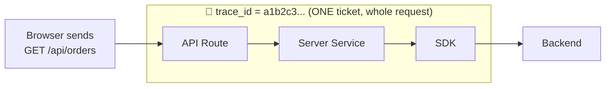
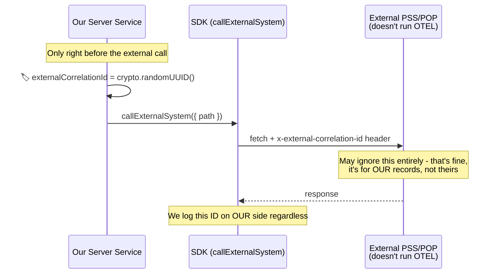
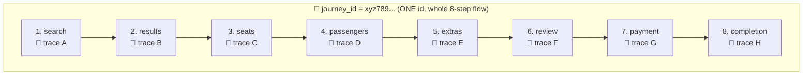
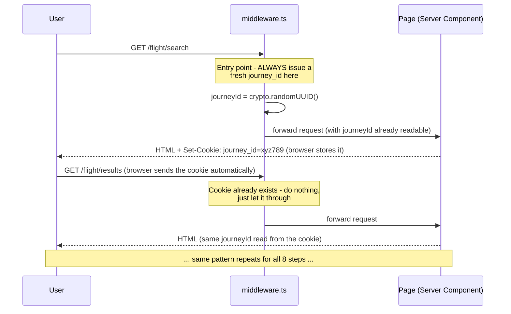
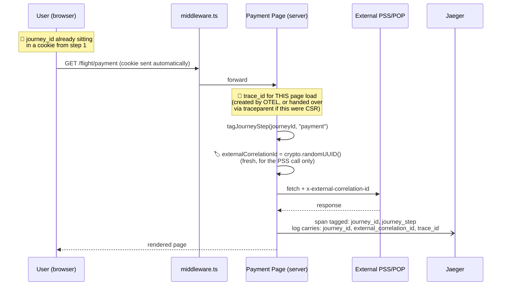

# 📖 Understanding trace_id, traceparent, external_correlation_id, and journey_id

A teaching doc for the team — written for anyone joining fresh, no prior
tracing/observability background assumed. By the end you should be able to
explain, in your own words, why we need **four** different concepts instead
of just one, and point to exactly where each one lives in this codebase.

> If you read an earlier version of this doc: `correlation_id` (a custom
> browser→server header) has been replaced by `traceparent` (§3) for
> systems we control, and renamed to `external_correlation_id` (§3a) for
> systems we don't. See `ARCHITECTURE.md` Decision 1 for why.

---

## Table of Contents

1. [The Problem, Before Any IDs Exist](#1-the-problem-before-any-ids-exist)
2. [trace_id — "What happened in this one request?"](#2-trace_id--what-happened-in-this-one-request)
3. [traceparent — "Let the browser hand the server a real trace_id"](#3-traceparent--let-the-browser-hand-the-server-a-real-trace_id)
   - [3a. external_correlation_id — "For systems that don't play along"](#3a-external_correlation_id--for-systems-that-dont-play-along)
4. [journey_id — "Show me this whole multi-step flow"](#4-journey_id--show-me-this-whole-multi-step-flow)
5. [All Four Together](#5-all-four-together)
6. [Side-by-Side Comparison](#6-side-by-side-comparison)
7. [Where to Find Each One in Our Code](#7-where-to-find-each-one-in-our-code)
8. [FAQ](#8-faq)
9. [Try It Yourself](#9-try-it-yourself)

---

## 1. The Problem, Before Any IDs Exist

Imagine a user emails support: **"My flight booking failed."**

With no IDs, that's all you have. Somewhere in millions of log lines from
dozens of servers, one specific attempt by one specific user failed, at
some unknown point, for some unknown reason. Finding it is close to
impossible.

Every concept in this document exists to answer one question, at a
different scale:

| Question | Scale | Answer |
|---|---|---|
| "What exactly happened during **this one request**, across every system we control?" | One request | `trace_id` (via `traceparent`) |
| "What did we send to **this external vendor**, on this one call?" | One outbound call to a system we don't control | `external_correlation_id` |
| "Show me **everything** across this user's whole booking attempt" | Many requests, over minutes | `journey_id` |

None of them replace the others. A real request in our system can carry
**more than one of these at the same time**, because they solve different
problems.

---

## 2. `trace_id` — "What happened in this one request?"

### The analogy

Think of a **kitchen order ticket** at a restaurant. The moment a waiter
sends an order to the kitchen, it gets one ticket number. Every station
that touches that order — grill, salad, plating — writes on the *same*
ticket. When the dish is served, that ticket's job is done. The next
customer's order gets a brand new ticket number.

### What it actually is

`trace_id` is generated **automatically by OpenTelemetry**, the moment a
request hits code we've instrumented (an API route, a page render). You
never write code to create one — you only ever *read* it.

Everything that happens **inside that one request** — even across several
function calls, even across a network call to another service — shares
that same `trace_id`, as long as each hop is properly instrumented to pass
it along.

### Diagram



### In our code

```typescript
// packages/otel/src/log-helper.ts
export function getTraceContext(): { traceId: string; spanId: string } | undefined {
  const span = trace.getActiveSpan();  // OTEL already created this - we just read it
  // ...
  return { traceId: ctx.traceId, spanId: ctx.spanId };
}
```

```typescript
// apps/ibe-app/app/api/orders/route.ts
const traceId = getTraceContext()?.traceId;
return NextResponse.json({ orders, traceId }, {
  headers: { "x-trace-id": traceId },  // sent back so it's visible outside the server too
});
```

### See it live

```bash
curl -i http://localhost:3000/api/orders
# x-trace-id: a521b91c61c8c1c01875ddb941dd4e70
```

Paste that value into Jaeger's search box → you see the *entire* waterfall
for that one request: API route → server service → SDK → the actual
network call to the backend, with exact timing for each.

### The limit of `trace_id`

Refresh the page, and you get a **new** `trace_id`. It cannot follow a user
across multiple page loads, and it **does not exist yet** for anything
happening in the browser before the request reaches our server — there's
no OTEL SDK running client-side. That gap is what `traceparent` (§3)
closes — surprisingly, without needing a full browser tracer after all.

---

## 3. `traceparent` — "Let the browser hand the server a real trace_id"

### The analogy

Imagine a courier service where, normally, the sorting depot stamps a new
tracking number on every package the moment it arrives. But suppose the
*sender* is allowed to pre-print their own tracking number on the package
before it ever reaches the depot — using the depot's own numbering format.
The depot sees a properly formatted number already there and just
**continues using it**, instead of stamping a new one. The package's whole
journey — sender, depot, next depot, final delivery truck — is now
trackable under **one number**, chosen by the sender, not invented partway
through.

### The problem this solves

Section 2 said `trace_id` only starts once a request reaches our server —
there's no OTEL SDK in the browser, so a browser click has no `trace_id`
yet. The obvious fix would be "put a real OTEL tracer in the browser" — but
that costs bundle size, needs special network configuration (CORS) for the
browser to talk to the tracing backend, and exposes infrastructure that's
normally kept internal.

`traceparent` is the surprising middle ground: **you don't need a real
tracer to hand over a real trace_id.** The W3C standard for propagating
trace context doesn't check whether the sender was "really" tracing
anything — it just reads a correctly formatted value and uses it. So the
browser can *format* a valid trace_id by hand (using nothing but
`crypto.randomUUID()`) and the server will treat it as if it always was the
trace_id — because, as far as OTEL is concerned, it is.

### Diagram

```mermaid
sequenceDiagram
    participant U as User (browser)
    participant CS as Client Service
    participant API as API Route (server)
    participant J as Jaeger

    U->>CS: clicks "Fetch Orders"
    CS->>CS: 🎫 traceparent = "00-&lt;32 hex&gt;-&lt;16 hex&gt;-01"<br/>(hand-formatted, no real tracer involved)
    CS->>API: GET /api/orders<br/>header: traceparent
    Note over API: @vercel/otel extracts this<br/>BEFORE the handler even runs
    API-->>CS: x-trace-id == the browser's own trace-id
    API-)J: trace recorded under<br/>the browser-chosen trace_id
```

### In our code

```typescript
// packages/otel/src/trace-context.ts (dependency-free, browser-safe)
export function generateTraceparent(): string {
  const traceId = randomHex(32);
  const parentId = randomHex(16);
  return `00-${traceId}-${parentId}-01`;
}
```

```typescript
// apps/ibe-app/app/lib/client/orders-client-service.ts (runs in the BROWSER)
import { generateTraceparent } from "@yourorg/otel/src/trace-context";

export async function fetchOrdersFromClient(): Promise<OrdersResponse> {
  const traceparent = generateTraceparent();  // created here, before any request
  const response = await fetch("/api/orders", { headers: { traceparent } });
  // ...
}
```

Nothing needs to change on the server at all — `@vercel/otel`'s existing
auto-instrumentation already extracts an incoming `traceparent` header.
`getTraceContext()?.traceId` inside the API route now simply *is* the
value the browser generated.

> ⚠️ Same rule as before: `orders-client-service.ts` imports
> `generateTraceparent` from `@yourorg/otel/src/trace-context` — a specific
> subpath with zero Node dependencies — never `@yourorg/otel`'s main entry,
> which pulls in `@vercel/otel` and breaks in a browser bundle.

### See it live — proven, not just claimed

```bash
curl -i http://localhost:3000/api/orders \
  -H "traceparent: 00-4bf92f3577b34da6a3ce929d0e0e4736-00f067aa0ba902b7-01"
# x-trace-id: 4bf92f3577b34da6a3ce929d0e0e4736   ← exactly what we sent
```
Search that trace-id in Jaeger and you'll find a **fully populated trace**
— every span, exactly as if a real request had generated it normally.

### Why this replaced the old `x-correlation-id` approach

An earlier version of this system used a custom `x-correlation-id` header
instead. It worked, but Jaeger had no idea what to do with it — it was just
a string you had to search for manually. `traceparent` gives the exact same
browser→server linkage, except it becomes the **real trace_id**, and — this
is the part that matters most in a company with more than one
language/team — it **automatically continues into any other OTEL-instrumented
service** downstream (a Java backend, for example) with zero extra code,
because that's what the W3C standard is *for*.

### The limit of `traceparent`

It only helps for systems that **run OTEL and extract it** — your own
services. A third-party vendor system almost certainly won't. That gap is
what §3a covers next.

---

## 3a. `external_correlation_id` — "For systems that don't play along"

### The analogy

You ship a package through your own courier network (tracking number
included, everyone along the way honors it) — but the *final leg* is
handed off to a completely different company that has its own separate
tracking system and has never heard of yours. You still write your
tracking number on the handoff paperwork, but you can't expect their
system to adopt it — it's just a note on *your* copy of the paperwork, so
if something goes wrong, you at least know which of their shipments was
yours.

### Why `traceparent` doesn't help here

`traceparent` only works if **both sides** understand it. A vendor
integration — an airline PSS (Passenger Service System), a payment
gateway, any third-party API — almost certainly doesn't run OTEL and won't
extract or forward anything from the header. Sending it `traceparent` costs
nothing, but it also gains nothing.

### What we do instead

Generate a plain ID, right before calling that specific external system,
and log it on **our own side** — so even if the vendor ignores it
completely, we still have a durable record: "we sent them this exact ID,
on this exact request, at this exact time."

### Diagram



### In our code

```typescript
// apps/ibe-app/app/lib/server/flight-journey-service.ts
if (step === "payment") {
  const externalCorrelationId = crypto.randomUUID();
  await runWithExternalCorrelationId(externalCorrelationId, async () => {
    await callExternalSystem({ path: "/posts/1" }); // stand-in for a real PSS/POP call
  });
}
```

### `correlation_id` vs `external_correlation_id` — same mechanism, different job

If this looks familiar to an older version of this doc: it is the same
`AsyncLocalStorage` pattern that used to be called `correlation_id` for the
browser→server boundary. Once `traceparent` took over that job (§3), the
mechanism was renamed and rescoped specifically to **calls that leave our
own systems entirely** — `packages/otel/src/external-correlation.ts`. Same
tool, deliberately narrowed to the one problem `traceparent` can't solve.

---

## 4. `journey_id` — "Show me this whole multi-step flow"

### The analogy

Think of a **flight reservation number** for a trip with several connecting
flights. Each leg of the trip — London→Dubai, Dubai→Singapore — has its own
flight number, gate, and crew (its own "trace", if you like). But your
reservation number ties the *entire trip* together. If your bag gets lost,
an agent doesn't need to know which of the three flight numbers it was on —
they search by your one reservation number and see the whole itinerary.

### Why `trace_id` isn't enough here

Our real flight-booking flow is **8 separate page loads**:
`search → results → seats → passengers → extras → review → payment → completion`.
Each page load is its own request, so it gets its **own** `trace_id` (or
its own `traceparent`, if generated client-side per page). There is no way
to make one `trace_id` span 8 page loads over several minutes — and you
wouldn't want to: a trace is meant to be one bounded operation lasting
milliseconds, not a multi-minute user session. Forcing that would make the
trace view in Jaeger unreadable.

`journey_id` solves this by being generated **once**, then deliberately
**reused** across all 8 requests — the opposite of `trace_id`, which is
fresh every time (whether server-generated or handed over via
`traceparent`).

### Diagram



Notice: **8 different trace tickets, 1 reservation number.**

### How it survives 8 separate page loads

This is the tricky part, worth understanding well: each page load is a
fresh HTTP request to the server. Nothing "remembers" anything between them
— unless we explicitly store something the browser will send back every
time. That's exactly what a **cookie** does.



### Why does `middleware.ts` exist at all?

A React Server Component **cannot set a cookie itself** — only middleware,
a Route Handler, or a Server Action can. Since our 8 pages are plain Server
Components, something else has to set the cookie *before* the page renders.
That's the entire job of `middleware.ts`.

### In our code

```typescript
// packages/otel/src/journey.ts
export function tagJourneyStep(journeyId: string, step: string) {
  const span = trace.getActiveSpan();
  span.setAttribute("journey_id", journeyId);   // ← a real, searchable span tag
  span.setAttribute("journey_step", step);
}
```

```typescript
// apps/ibe-app/middleware.ts (runs on the Edge runtime)
const isFlowEntryPoint = request.nextUrl.pathname === "/flight/search";
if (isFlowEntryPoint || !existingId) {
  const journeyId = crypto.randomUUID();
  // ... set the cookie so every subsequent page load carries it automatically
}
```

> ⚠️ Same rule as the browser's client service: `middleware.ts` runs on
> the **Edge runtime**, which also has no `async_hooks`. It must never
> import `@yourorg/otel`'s main entry — it only does plain cookie logic.

### The one detail that makes this actually useful

Setting `journey_id` as a `span.setAttribute(...)` — not just inside a log
message — is what makes it **searchable in Jaeger across all 8 traces at
once**. Search `journey_id=xyz789` in Jaeger and you get back all 8
separate traces, each labeled with its own step:

```bash
# Query Jaeger directly for one journey_id, get back every trace in it:
curl -G "http://localhost:16686/api/traces" \
  --data-urlencode "service=ibe-app" \
  --data-urlencode 'tags={"journey_id":"xyz789..."}'

# Returns 8 traces:
#   trace A | step: search
#   trace B | step: results
#   trace C | step: seats
#   ...
#   trace H | step: completion | status: completed
```

---

## 5. All Four Together

Here's the flight flow's payment step, showing all four IDs doing their
separate jobs at once — this is the one step where every concept in this
doc is active simultaneously:



At this single moment, all four exist simultaneously:
- **`trace_id`** — unique to this exact page load
- **`traceparent`** — the mechanism that *would* have carried `trace_id` in from the browser, had this been a CSR call (§3)
- **`external_correlation_id`** — unique to this exact call to PSS, scoped narrowly to just that one outbound request
- **`journey_id`** — shared with 7 other page loads before/after this one

---

## 6. Side-by-Side Comparison

| | `trace_id` (via `traceparent`) | `external_correlation_id` | `journey_id` |
|---|---|---|---|
| **Created by** | The browser or SSR page (hand-formatted), or OTEL itself if none was sent | Our code, immediately before calling an external system | Our code, in `middleware.ts` |
| **Created when** | Before the request is sent (if client-generated) | Right before the one external call | Once, at the very first step of a flow |
| **Regenerated** | Every single request | Every single external call | Only at the flow's entry point |
| **Lives in** | The `traceparent` HTTP header, then OTEL's internal span context | An HTTP header (`x-external-correlation-id`) | A cookie (`journey_id`) |
| **Survives a page reload?** | No — new one every time | No — new one every time | **Yes** — that's the whole point |
| **Continues into other OTEL services automatically?** | **Yes** — that's the whole point of the W3C standard | No — the external system likely doesn't run OTEL at all | N/A (not a trace concept) |
| **Where it's stored in code** | `packages/otel/src/trace-context.ts` (generate) / `log-helper.ts` (read) | `packages/otel/src/external-correlation.ts` | `packages/otel/src/journey.ts` |
| **Searchable in Jaeger by tag?** | Yes (it's the trace itself) | No (it's inside log events, not a span tag) | **Yes** (set via `span.setAttribute`) |
| **Answers** | "What happened in this one request, across every system we control?" | "What did we send to this external vendor, on this call?" | "Show me this user's whole flow" |

---

## 7. Where to Find Each One in Our Code

| Concept | File | What to look for |
|---|---|---|
| `trace_id` read | `packages/otel/src/log-helper.ts` | `getTraceContext()` |
| `traceparent` generated (browser-safe) | `packages/otel/src/trace-context.ts` | `generateTraceparent()` — import via `/src/trace-context` subpath |
| `traceparent` sent (browser) | `apps/ibe-app/app/lib/client/orders-client-service.ts` | `traceparent` header on `fetch` |
| `traceparent` sent (SSR) | `apps/ibe-app/app/orders-ssr/page.tsx` | `traceparent` header on `fetch` |
| `trace_id` survives failure | `apps/ibe-app/app/lib/redux/ordersSlice.ts` | `rejectWithValue(result)` |
| `external_correlation_id` storage | `packages/otel/src/external-correlation.ts` | `runWithExternalCorrelationId()` / `getExternalCorrelationId()` |
| `external_correlation_id` used | `apps/ibe-app/app/lib/server/flight-journey-service.ts` (payment step) | `runWithExternalCorrelationId()` wrapping `callExternalSystem()` |
| Our backend vs external system, side by side | `packages/sdk/src/index.ts` | `callBackend()` (no correlation code) vs `callExternalSystem()` (explicit header) |
| `journey_id` storage + tagging | `packages/otel/src/journey.ts` | `runWithJourneyId()`, `tagJourneyStep()`, `tagJourneyStatus()` |
| `journey_id` cookie logic | `apps/ibe-app/middleware.ts` | Edge runtime, sets/forwards the cookie |
| `journey_id` used per page | `apps/ibe-app/app/flight/_lib/render-step.tsx` | Reads the cookie, wraps the page |

For the full design reasoning (why `traceparent` over a custom header, why
a cookie for `journey_id`, why span attributes, the Edge-runtime bug we hit
along the way), see `ARCHITECTURE.md`. For step-by-step verification
commands, see `SSR_CSR_TRACING_DEMO.md`.

---

## 8. FAQ

**Q: If `trace_id` is automatic, why do we need to write any code for it at all?**
A: We don't create it — we just *read* it (`getTraceContext()`) so we can
show it to the user, put it in a response header, or include it in a log
line. OTEL does the actual creation.

**Q: Why not just use a custom header for everything, like the old `correlation_id` did?**
A: We tried that first! It worked for tying one browser click to one server
request, but Jaeger had no idea what to do with a custom string — you had
to search log messages by hand. `traceparent` gives the same linkage but
becomes the *real* `trace_id`, with automatic propagation into any other
OTEL-instrumented service (a Java backend, for example) for free. See
`ARCHITECTURE.md` Decision 1 for the full story of why this changed.

**Q: If `traceparent` is so much better, why does `external_correlation_id` still exist?**
A: Because `traceparent` only helps when *both* sides understand it. A
third-party vendor (PSS/POP, a payment gateway) almost certainly doesn't
run OTEL — sending it `traceparent` costs nothing but gains nothing either.
`external_correlation_id` exists specifically for that one remaining gap:
systems we don't control and can't assume anything about.

**Q: Could we just use `journey_id` for every request, and skip `trace_id`?**
A: No — if you reused `journey_id` as the trace ID for every single request
in an 8-page flow, Jaeger would try to draw one giant trace spanning
several minutes across 8 unrelated page loads, which produces an unusable
waterfall. Keeping them separate is deliberate.

**Q: Why can't the client service (browser) or middleware import `@yourorg/otel`'s main entry?**
A: Both run in environments without Node's `async_hooks` — the browser
entirely lacks it, and Next.js middleware runs on the Edge runtime, which
also lacks it. `@yourorg/otel`'s `external-correlation.ts` and `journey.ts`
both depend on `AsyncLocalStorage`, which is built on `async_hooks`, and
the main entry (`index.ts`) also eagerly imports `@vercel/otel` (Node-only).
Importing any of that in either place will break at runtime (we hit exactly
this bug with `@vercel/otel` on the Edge runtime — see `ARCHITECTURE.md`
§4). The one safe exception is `@yourorg/otel/src/trace-context` — a
separate subpath with zero Node dependencies, built specifically so the
browser has something it *can* safely import.

**Q: What happens if someone bookmarks `/flight/payment` and opens it directly, skipping steps 1-6?**
A: `middleware.ts` notices there's no `journey_id` cookie, generates a
fallback one, and flags it via an `x-journey-fallback` header so the page
logs a warning instead of silently pretending it's a normal flow. See
`ARCHITECTURE.md` for the full fallback design.

**Q: Do these IDs ever get confused with each other in the logs?**
A: No — each has its own field name (`trace_id`, `external_correlation_id`,
`journey_id`), and `createLogger()` stamps whichever ones are active onto
every log line automatically. On the payment step you'll see all three on
one line at once.

---

## 9. Try It Yourself

The best way to really understand this is to run it and watch the IDs
appear:

1. **See `trace_id` alone (server-generated):**
   ```bash
   curl -i http://localhost:3000/api/orders
   ```
   Note the `x-trace-id`. Run it again — it's different.

2. **See a hand-crafted `traceparent` become the actual `trace_id`:**
   ```bash
   curl -i http://localhost:3000/api/orders \
     -H "traceparent: 00-4bf92f3577b34da6a3ce929d0e0e4736-00f067aa0ba902b7-01"
   ```
   `x-trace-id` in the response comes back **exactly** as
   `4bf92f3577b34da6a3ce929d0e0e4736` — the value you made up is now the
   real trace_id. Search it in Jaeger; you'll find a full trace.

3. **See `external_correlation_id` appear only during the payment step:**
   ```bash
   rm -f /tmp/fc.txt
   curl -s -c /tmp/fc.txt http://localhost:3000/flight/search -o /dev/null
   for step in results seats passengers extras review payment; do
     curl -s -b /tmp/fc.txt -c /tmp/fc.txt http://localhost:3000/flight/$step -o /tmp/$step.html
   done
   grep -o 'externalCorrelationId[^<]*<code>[^<]*' /tmp/payment.html
   ```
   You'll see it on `payment` — but if you `grep` the same pattern against
   `/tmp/seats.html` or any other step, nothing shows up, because
   `runWithExternalCorrelationId()` only wraps that one call.

4. **See `journey_id` survive multiple requests:**
   ```bash
   curl -c /tmp/cookies.txt http://localhost:3000/flight/search -o /dev/null -s
   curl -b /tmp/cookies.txt http://localhost:3000/flight/results -o /tmp/r.html -s
   grep -o 'journeyId:.\{0,45\}' /tmp/r.html
   ```
   Compare the `journeyId` shown against the one from the first request —
   same value, even though it was a completely separate `curl` call.

5. **Search Jaeger by `journey_id` and watch 8 traces come back at once** —
   full walkthrough in `SSR_CSR_TRACING_DEMO.md` §7.
