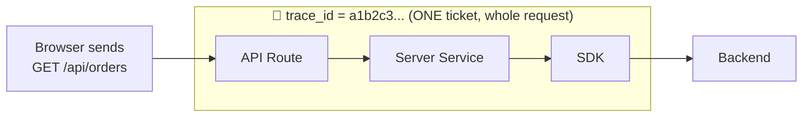
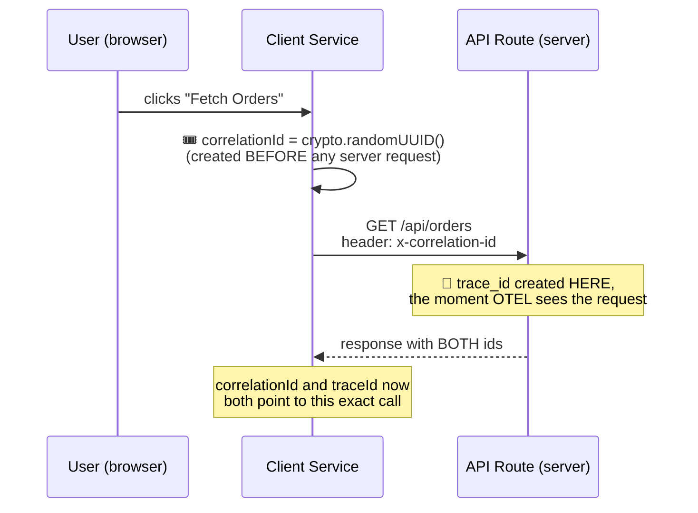
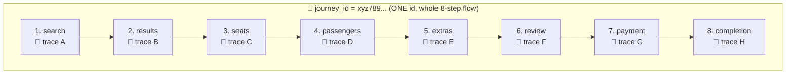
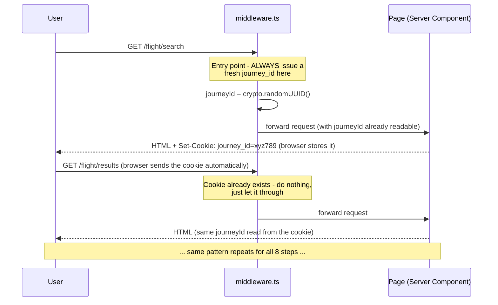
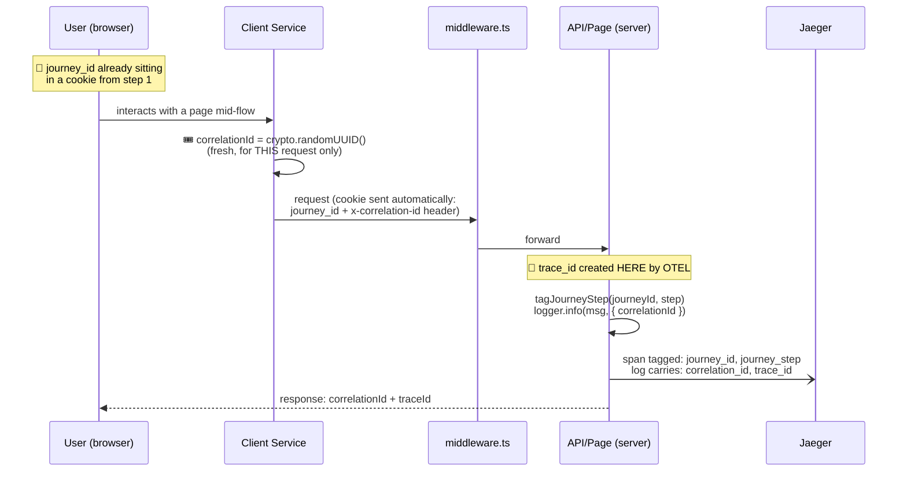

# 📖 Understanding trace_id, correlation_id, and journey_id

A teaching doc for the team — written for anyone joining fresh, no prior
tracing/observability background assumed. By the end you should be able to
explain, in your own words, why we need **three** different IDs instead of
just one, and point to exactly where each one lives in this codebase.

---

## Table of Contents

1. [The Problem, Before Any IDs Exist](#1-the-problem-before-any-ids-exist)
2. [trace_id — "What happened in this one request?"](#2-trace_id--what-happened-in-this-one-request)
3. [correlation_id — "Which server work belongs to this browser action?"](#3-correlation_id--which-server-work-belongs-to-this-browser-action)
4. [journey_id — "Show me this whole multi-step flow"](#4-journey_id--show-me-this-whole-multi-step-flow)
5. [All Three Together](#5-all-three-together)
6. [Side-by-Side Comparison](#6-side-by-side-comparison)
7. [Where to Find Each One in Our Code](#7-where-to-find-each-one-in-our-code)
8. [FAQ](#8-faq)
9. [Try It Yourself](#9-try-it-yourself)

---

## 1. The Problem, Before Any IDs Exist

Imagine a user emails support: **"My flight booking failed."**

With no IDs, that's all you have. Somewhere in millions of log lines from
dozens of servers, one specific attempt by one specific user failed, at
some unknown point, for some unknown reason. Finding it is close to
impossible.

Every ID in this document exists to answer one question, at a different
scale:

| Question | Scale | Answer |
|---|---|---|
| "What exactly happened during **this one request**?" | One request | `trace_id` |
| "Which server-side work belongs to **this one browser click**?" | One browser→server round trip | `correlation_id` |
| "Show me **everything** across this user's whole booking attempt" | Many requests, over minutes | `journey_id` |

None of them replace the others. A real request in our system carries
**more than one of these at the same time**, because they solve different
problems.

---

## 2. `trace_id` — "What happened in this one request?"

### The analogy

Think of a **kitchen order ticket** at a restaurant. The moment a waiter
sends an order to the kitchen, it gets one ticket number. Every station
that touches that order — grill, salad, plating — writes on the *same*
ticket. When the dish is served, that ticket's job is done. The next
customer's order gets a brand new ticket number.

### What it actually is

`trace_id` is generated **automatically by OpenTelemetry**, the moment a
request hits code we've instrumented (an API route, a page render). You
never write code to create one — you only ever *read* it.

Everything that happens **inside that one request** — even across several
function calls, even across a network call to another service — shares
that same `trace_id`, as long as each hop is properly instrumented to pass
it along.

### Diagram



### In our code

```typescript
// packages/otel/src/log-helper.ts
export function getTraceContext(): { traceId: string; spanId: string } | undefined {
  const span = trace.getActiveSpan();  // OTEL already created this - we just read it
  // ...
  return { traceId: ctx.traceId, spanId: ctx.spanId };
}
```

```typescript
// apps/ibe-app/app/api/orders/route.ts
const traceId = getTraceContext()?.traceId;
return NextResponse.json({ orders, traceId }, {
  headers: { "x-trace-id": traceId },  // sent back so it's visible outside the server too
});
```

### See it live

```bash
curl -i http://localhost:3000/api/orders
# x-trace-id: a521b91c61c8c1c01875ddb941dd4e70
```

Paste that value into Jaeger's search box → you see the *entire* waterfall
for that one request: API route → server service → SDK → the actual
network call to the backend, with exact timing for each.

### The limit of `trace_id`

Refresh the page, and you get a **new** `trace_id`. It cannot follow a user
across multiple page loads, and it **does not exist yet** for anything
happening in the browser before the request reaches our server — there's
no OTEL SDK running client-side. That gap is what `correlation_id` solves.

---

## 3. `correlation_id` — "Which server work belongs to this browser action?"

### The analogy

Think of the **receipt number** printed the instant you place an order at
a counter — *before* the kitchen ticket even exists. If your food is wrong,
you don't know the kitchen's internal ticket number; you only have your
receipt. Staff use your receipt number to go find the matching kitchen
ticket. Two different numbers, same order, created by two different
systems, at two different moments.

### Why `trace_id` alone isn't enough here

A button click in the browser (`/orders` page → "Fetch Orders") happens
**before** any `trace_id` exists — the trace only starts once the request
lands on our server. If something goes wrong purely on the browser side
(the fetch never even leaves, say), there's no `trace_id` to find at all.

`correlation_id` is generated **in the browser, before the request is
sent** — so it exists independently of whether a trace ever gets created.

### Diagram



### In our code

```typescript
// apps/ibe-app/app/lib/client/orders-client-service.ts (runs in the BROWSER)
export async function fetchOrdersFromClient(): Promise<OrdersResponse> {
  const correlationId = crypto.randomUUID();  // ← created here, client-side, before any request

  const response = await fetch("/api/orders", {
    headers: { "x-correlation-id": correlationId },
  });
  // ...
}
```

```typescript
// apps/ibe-app/app/api/orders/route.ts (runs on the SERVER)
const correlationId = request.headers.get("x-correlation-id") ?? crypto.randomUUID();
return runWithCorrelationId(correlationId, async () => {
  // every log line in here automatically includes this correlationId
});
```

> ⚠️ Important detail: `orders-client-service.ts` **cannot** import
> `@yourorg/otel` — that package uses Node's `async_hooks`, which doesn't
> exist in a browser. `correlation_id` generation on the client is
> deliberately just plain `crypto.randomUUID()`, nothing OTEL-specific.

### See it live

Open DevTools Network tab, click **Fetch Orders** on `/orders`, inspect the
request — you'll see `x-correlation-id` sent by the browser, and the same
value echoed back in the response, alongside a fresh `x-trace-id`.

### The limit of `correlation_id`

It's still scoped to **one request** — generated fresh every time you call
`/api/orders`. It doesn't help if you need to tie together 8 *different*
requests across 8 *different* page loads. That's what `journey_id` solves.

---

## 4. `journey_id` — "Show me this whole multi-step flow"

### The analogy

Think of a **flight reservation number** for a trip with several connecting
flights. Each leg of the trip — London→Dubai, Dubai→Singapore — has its own
flight number, gate, and crew (its own "trace", if you like). But your
reservation number ties the *entire trip* together. If your bag gets lost,
an agent doesn't need to know which of the three flight numbers it was on —
they search by your one reservation number and see the whole itinerary.

### Why `trace_id` and `correlation_id` aren't enough here

Our real flight-booking flow is **8 separate page loads**:
`search → results → seats → passengers → extras → review → payment → completion`.
Each page load is its own request, so it gets its **own** `trace_id`. There
is no way to make one `trace_id` span 8 page loads over several minutes —
and you wouldn't want to: a trace is meant to be one bounded operation
lasting milliseconds, not a multi-minute user session. Forcing that would
make the trace view in Jaeger unreadable.

`journey_id` solves this by being generated **once**, then deliberately
**reused** across all 8 requests — the opposite of `trace_id` and
`correlation_id`, which are regenerated every time.

### Diagram



Notice: **8 different trace tickets, 1 reservation number.**

### How it survives 8 separate page loads

This is the tricky part, worth understanding well: each page load is a
fresh HTTP request to the server. Nothing "remembers" anything between them
— unless we explicitly store something the browser will send back every
time. That's exactly what a **cookie** does.



### Why does `middleware.ts` exist at all?

A React Server Component **cannot set a cookie itself** — only middleware,
a Route Handler, or a Server Action can. Since our 8 pages are plain Server
Components, something else has to set the cookie *before* the page renders.
That's the entire job of `middleware.ts`.

### In our code

```typescript
// packages/otel/src/journey.ts
export function tagJourneyStep(journeyId: string, step: string) {
  const span = trace.getActiveSpan();
  span.setAttribute("journey_id", journeyId);   // ← a real, searchable span tag
  span.setAttribute("journey_step", step);
}
```

```typescript
// apps/ibe-app/middleware.ts (runs on the Edge runtime)
const isFlowEntryPoint = request.nextUrl.pathname === "/flight/search";
if (isFlowEntryPoint || !existingId) {
  const journeyId = crypto.randomUUID();
  // ... set the cookie so every subsequent page load carries it automatically
}
```

> ⚠️ Same rule as `correlation_id`'s client service: `middleware.ts` runs
> on the **Edge runtime**, which also has no `async_hooks`. It must never
> import `@yourorg/otel` — it only does plain cookie logic.

### The one detail that makes this actually useful

Setting `journey_id` as a `span.setAttribute(...)` — not just inside a log
message — is what makes it **searchable in Jaeger across all 8 traces at
once**. Search `journey_id=xyz789` in Jaeger and you get back all 8
separate traces, each labeled with its own step:

```bash
# Query Jaeger directly for one journey_id, get back every trace in it:
curl -G "http://localhost:16686/api/traces" \
  --data-urlencode "service=ibe-app" \
  --data-urlencode 'tags={"journey_id":"xyz789..."}'

# Returns 8 traces:
#   trace A | step: search
#   trace B | step: results
#   trace C | step: seats
#   ...
#   trace H | step: completion | status: completed
```

---

## 5. All Three Together

Here's a single CSR request inside the flight flow, showing all three IDs
doing their separate jobs at once:



At this single moment, all three exist simultaneously:
- **`trace_id`** — unique to this exact request
- **`correlation_id`** — unique to this exact browser action
- **`journey_id`** — shared with 7 other requests before/after this one

---

## 6. Side-by-Side Comparison

| | `trace_id` | `correlation_id` | `journey_id` |
|---|---|---|---|
| **Created by** | OpenTelemetry, automatically | Our code, in the browser or SSR page | Our code, in `middleware.ts` |
| **Created when** | The moment a request hits instrumented code | Before the request is even sent | Once, at the very first step of a flow |
| **Regenerated** | Every single request | Every single request | Only at the flow's entry point |
| **Lives in** | OTEL's internal span context | An HTTP header (`x-correlation-id`) | A cookie (`journey_id`) |
| **Survives a page reload?** | No — new one every time | No — new one every time | **Yes** — that's the whole point |
| **Where it's stored in code** | `packages/otel/src/log-helper.ts` | `packages/otel/src/correlation.ts` | `packages/otel/src/journey.ts` |
| **Searchable in Jaeger by tag?** | Yes (it's the trace itself) | No (it's inside log events, not a span tag) | **Yes** (set via `span.setAttribute`) |
| **Answers** | "What happened in this one request?" | "Which server work is this one browser click?" | "Show me this user's whole flow" |

---

## 7. Where to Find Each One in Our Code

| Concept | File | What to look for |
|---|---|---|
| `trace_id` read | `packages/otel/src/log-helper.ts` | `getTraceContext()` |
| `correlation_id` storage | `packages/otel/src/correlation.ts` | `runWithCorrelationId()` / `getCorrelationId()` |
| `correlation_id` generated (browser) | `apps/ibe-app/app/lib/client/orders-client-service.ts` | `crypto.randomUUID()` |
| `correlation_id` generated (SSR) | `apps/ibe-app/app/orders-ssr/page.tsx` | `crypto.randomUUID()` |
| `correlation_id` survives failure | `apps/ibe-app/app/lib/redux/ordersSlice.ts` | `rejectWithValue(result)` |
| `journey_id` storage + tagging | `packages/otel/src/journey.ts` | `runWithJourneyId()`, `tagJourneyStep()`, `tagJourneyStatus()` |
| `journey_id` cookie logic | `apps/ibe-app/middleware.ts` | Edge runtime, sets/forwards the cookie |
| `journey_id` used per page | `apps/ibe-app/app/flight/_lib/render-step.tsx` | Reads the cookie, wraps the page |

For the full design reasoning (why a cookie, why span attributes, the
Edge-runtime bug we hit along the way), see `ARCHITECTURE.md`. For
step-by-step verification commands, see `SSR_CSR_TRACING_DEMO.md`.

---

## 8. FAQ

**Q: If `trace_id` is automatic, why do we need to write any code for it at all?**
A: We don't create it — we just *read* it (`getTraceContext()`) so we can
show it to the user, put it in a response header, or include it in a log
line. OTEL does the actual creation.

**Q: Could we just use `correlation_id` for everything, and skip `trace_id`?**
A: No — `trace_id` is what OTEL's whole tracing system (spans, timing,
the Jaeger waterfall view) is built around. `correlation_id` is a plain
string with no automatic timing or waterfall behind it; it's only useful
for *searching and matching*, not for seeing *how long each step took*.

**Q: Could we just use `journey_id` for every request, and skip `trace_id`/`correlation_id`?**
A: No — if you reused `journey_id` as the trace ID for every single request
in an 8-page flow, Jaeger would try to draw one giant trace spanning
several minutes across 8 unrelated page loads, which produces an unusable
waterfall. Keeping them separate is deliberate.

**Q: Why can't the client service (browser) or middleware import `@yourorg/otel`?**
A: Both run in environments without Node's `async_hooks` — the browser
entirely lacks it, and Next.js middleware runs on the Edge runtime, which
also lacks it. `@yourorg/otel`'s `correlation.ts` and `journey.ts` both
depend on `AsyncLocalStorage`, which is built on `async_hooks`. Importing
it in either place will break at runtime (we hit exactly this bug with
`@vercel/otel` on the Edge runtime — see `ARCHITECTURE.md` §4).

**Q: What happens if someone bookmarks `/flight/payment` and opens it directly, skipping steps 1-6?**
A: `middleware.ts` notices there's no `journey_id` cookie, generates a
fallback one, and flags it via an `x-journey-fallback` header so the page
logs a warning instead of silently pretending it's a normal flow. See
`ARCHITECTURE.md` for the full fallback design.

**Q: Do these three IDs ever get confused with each other in the logs?**
A: No — each has its own field name (`trace_id`, `correlation_id`,
`journey_id`), and `createLogger()` stamps whichever ones are active onto
every log line automatically. You'll often see all three on one line.

---

## 9. Try It Yourself

The best way to really understand this is to run it and watch the IDs
appear:

1. **See `trace_id` alone:**
   ```bash
   curl -i http://localhost:3000/api/orders
   ```
   Note the `x-trace-id`. Run it again — it's different.

2. **See `correlation_id` + `trace_id` together:**
   ```bash
   curl -i http://localhost:3000/api/orders -H "x-correlation-id: my-test-123"
   ```
   Your `x-correlation-id` comes back unchanged; `x-trace-id` is still new
   every time.

3. **See `journey_id` survive multiple requests:**
   ```bash
   curl -c /tmp/cookies.txt http://localhost:3000/flight/search -o /dev/null -s
   curl -b /tmp/cookies.txt http://localhost:3000/flight/results -o /tmp/r.html -s
   grep -o 'journeyId:.\{0,45\}' /tmp/r.html
   ```
   Compare the `journeyId` shown against the one from the first request —
   same value, even though it was a completely separate `curl` call.

4. **Search Jaeger by `journey_id` and watch 8 traces come back at once** —
   full walkthrough in `SSR_CSR_TRACING_DEMO.md` §7.
